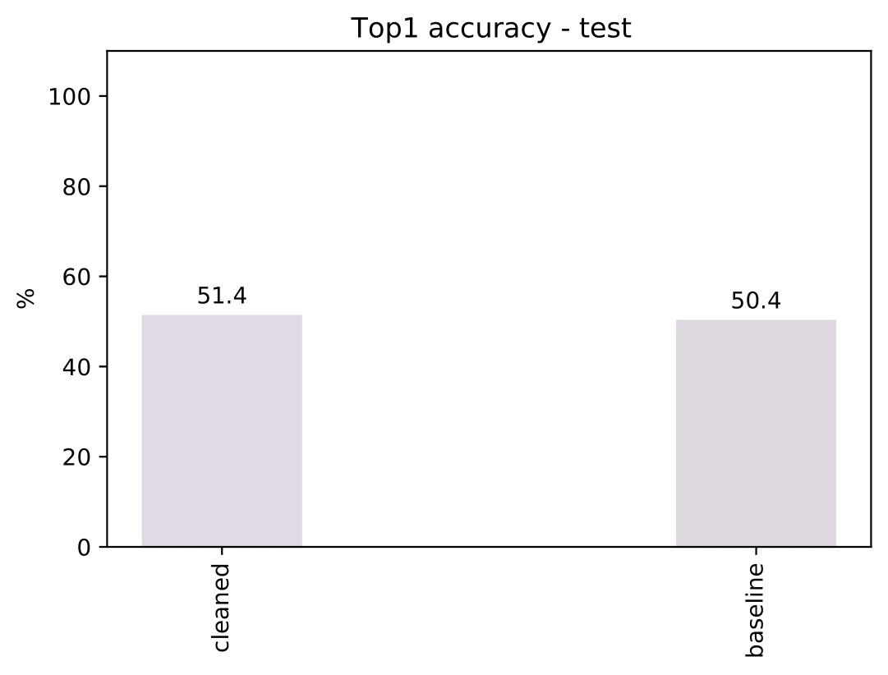

ONMT_UTILS
==========

Repository to evaluate the results from OpenNMT:

Documentation: http://opennmt.net/OpenNMT-py/

System Requirements
-------------------
### Hardware requirements
`onmt_utils` package requires only a standard computer with enough RAM to support the in-memory operations.
### Software Requirements
This package is supported for *macOS* and *Linux*. The package has been tested on the following systems:
* macOS (which one?)

Installation
------------
Install OpenNMT for training the models. `onmt_utils` will be automatically installed:
```
conda create -n onmt36 python=3.6
conda activate onmt36
conda install pytorch -c pytorch
conda install rdkit -c rdkit
git clone https://github.com/rxn4chemistry/OpenNMT-py.git
cd OpenNMT-py
git checkout noise_reduction
pip install -e .
conda install jupyter
```

Demo: the forgetting experiment
-------------------------------
The following demo is built to demonstate the use of the `onmt_utils` package and the implementation of the forgetting experiment:
https://chemrxiv.org/articles/Unassisted_Noise-Reduction_of_Chemical_Reactions_Data_Sets/12395120

In the `noise_data` folder of the repository a sample dataset is provided.
This dataset `schneider50k` comes from the following source:
https://pubs.acs.org/doi/abs/10.1021/ci5006614?casa_token=sehwHJvFfHwAAAAA:raZjdTRWdWB1aP8o06wMwWnVMKf_XtMctW_eYYwYWVgoNa_e0EEjVldu7D38XJ_Epht-nmc7JHABmhFB

Prior to preprocessing the data for model training, tokenized files need to be generated. To do so in `noise_scripts/` run:

```
python generate_training_files.py
```

In the `noise_data/schneider50k/` folder are now present the following files:
* `precursors-train.txt`, `precursors-test.txt`: the tokenized SMILES strings for the reactions' precursors, for train and test set respectively.
* `product-train.txt`, `product-test.txt`: the tokenized SMILES strings for the reactions' products, for train and test set respectively.
* `class-multi-train.txt`, `class-multi-test.txt`: the strings for the reactions' classes, for train and test set respectively. (ex. class 1.2.1 -> `1 1.2 1.2.1`, just `1` if the full classification is not provided)
* `class-single-train.txt`, `class-single-test.txt`: the superclass for the reactions' classes, for train and test set respectively. (ex. class 1.2.1 -> `1`)

NOTE: training on CPU can be very slow, therefore even if the scripts are written for CPU usage, it is highly encouraged to use a GPU and add the flag reported in the scripts. 
### Preprocessing

To generate the preprocessing files type the following in `noise_scripts/forgetting`:
```
bash run_preprocess.sh
```
The preprocessing files are stored in `noise_data/schneider50k/preprocess`.

### Training

To train the baseline model type the following inside `noise_scripts/forgetting`:
```
bash run_training.sh
```
The training script dumps a model each epoch and the model checkpoints are stored in:`noise_data/schneider50k/training`.

**NOTE**: `OpenNMT` does not provide a method to dump the results at each epoch, so the training must be lauched with the flag `--report_every 1` in order to inspect when the shards of data are reloaded. This was already done for this demo but needs to be done for a new dataset.

### Translation
To perform inference on each of the obtained models (one for each epoch) type the following inside `noise_scripts/forgetting`:
```
bash run_translation_all.sh
```
The translation script dumps the predictions for each epoch in:`noise_data/schneider50k/translation/train`.

### Postprocessing
To generate the cleaned datasets open and run the following python notebook found in `noise_notebooks/demo`:
```
jupyter notebook count_forgetting_events.ipynb
```
The reduced/cleaned datasets are stored in `noise_data/schneider50k-cleaned`.

### Preprocess and Train the most promising model
**NOTE**: all the reduced datasets need to be trained and compared to define the most promising model.
For the sake of time in this demo the best model was already chosen.

Preprocessing in `noise_scripts/forgetting`:
```
bash run_preprocess_cleaned.sh
```
The preprocessing files are stored in `noise_data/schneider50k-cleaned/20perc/preprocess`.

Training in `noise_scripts/forgetting`:
```
bash run_training_cleaned.sh
```
The training script dumps the model checkpoint in:`noise_data/schneider50k-cleaned/20perc/training`.

### Translate on the test set and compare the results
Inference for the `baseline model`. From the folder `noise_scripts/forgetting` type:
```
bash run_translation_one.sh
```
The translation script dumps the predictions for each epoch in:`noise_data/schneider50k/translation/test`.

Inference for the `cleaned model`. From the folder `noise_scripts/forgetting` type:
```
bash run_translation_one_cleaned.sh
```
The translation script dumps the predictions for each epoch in:`noise_data/schneider50k-cleaned/20perc/translation`.

To compare the two models on the test set run the following notebook that can be found in `noise_notebooks/demo`:
```
jupyter notebook forward_models_comparison.ipynb
```

Top1 accuracy results on test set:



Jensen Shannon divergence on test set:

.png)

Original notebooks
------------------
In `noise_notebooks/pistachio` are presente the original notebooks used to produce the results of the paper. They cannot be compiled due to the proprietary nature of the dataset but can be used as guidelines for the application of the procedure to an open dataset.
